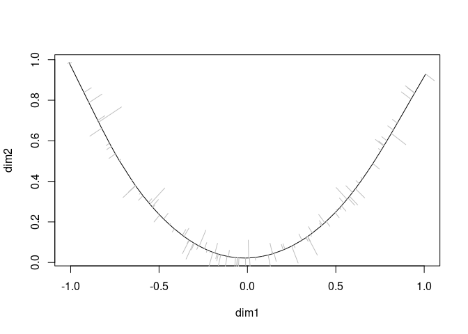

<!-- README.md is generated from README.Rmd. Please edit that file -->
princurve
=========

Fitting a principal curve to a data matrix in arbitrary dimensions.

Example
-------

    library(princurve)
    set.seed(1)
    x <- runif(100, -1, 1)
    x <- cbind(x, x ^ 2 + rnorm(100, sd = 0.1))

    fit1 <- principal_curve(x)
    plot(fit1); points(fit1); whiskers(x, fit1$s)

